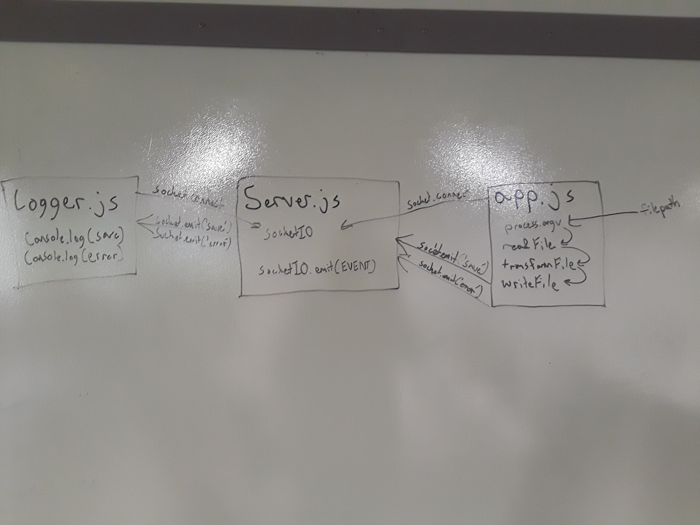

## Lab 18 - Socket.IO
Uses Socket.IO libraries for server, file handling client, and logger client
### Author: Chris Kozlowski

### Links and Resources
* [Submission PR](https://github.com/401-advanced-javascript-cdk/lab-18-socket-io/pull/1)

### Modules
#### `server.js`
Imports Socket.IO server library and opens a port for the server.  Logs new connections, and sends save and error events to the `/logger` client namespace.
#### `client.js`
Imports Socket.IO client library and connects to the server.  Performs a file transformation and emits a file-save event.  Emits a file-error event if an error occurs.
#### `logger.js`
Imports Socket.IO client library and connects to the server on the `/logger` namespace.  Listens for events in it's namespace and logs messages to the console when received.

#### Operation
* `nodemon server.js` - creates socket.io default server and `/logger` namespace server.
* `nodemon logger.js` - creates socket.io client on the `/logger` namespace and listens for messages.
* `node client.js ./files/test.txt` - creates socket.io client, preforms file transformation, the emits an event based on success or failure.

#### UML
